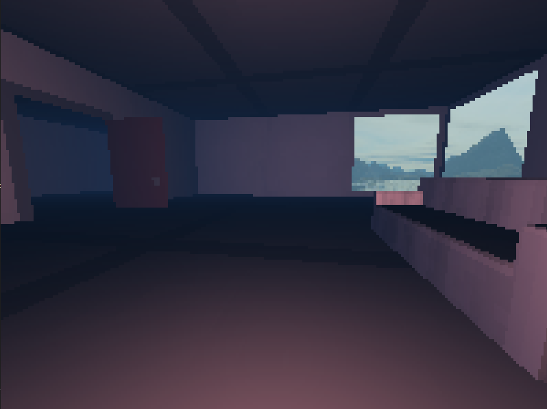

# 3D Renderer

A 3D rendering engine written in pure Java from scratch. 

Custom rasterizing pipeline without using any external graphics libraries.

# User interface

**Keyboard**

| Action | Key |
|--------|-----|
| Move Around | <kbd>W</kbd> <kbd>A</kbd> <kbd>S</kbd> <kbd>D</kbd>|
| Move Up |  <kbd>Jump</kbd> |

**Mouse**

Move mouse to pan around.